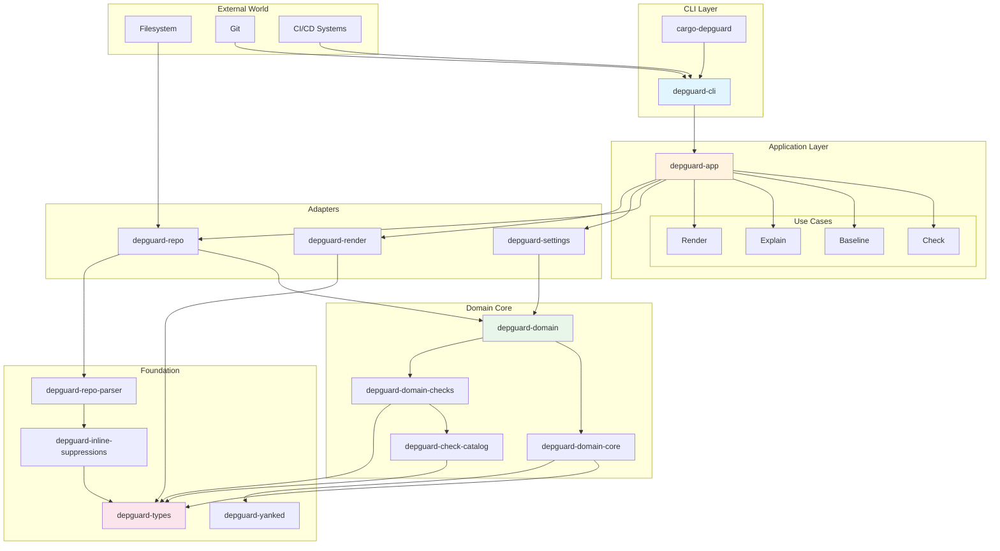
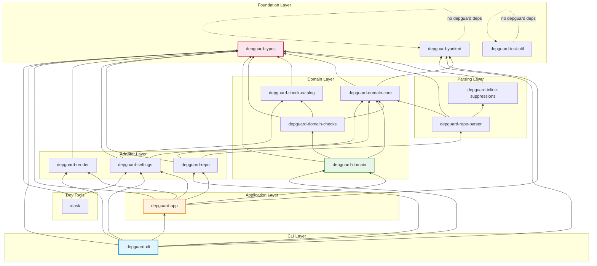
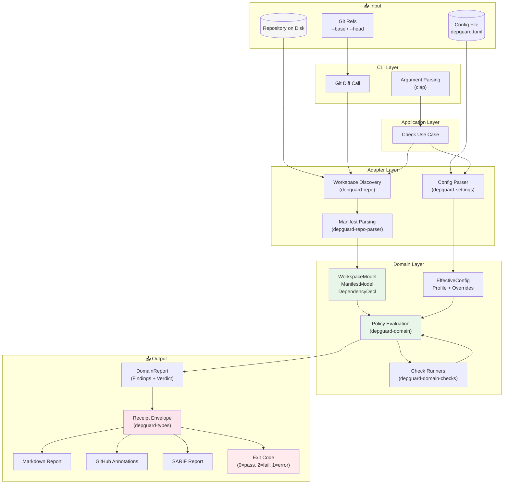
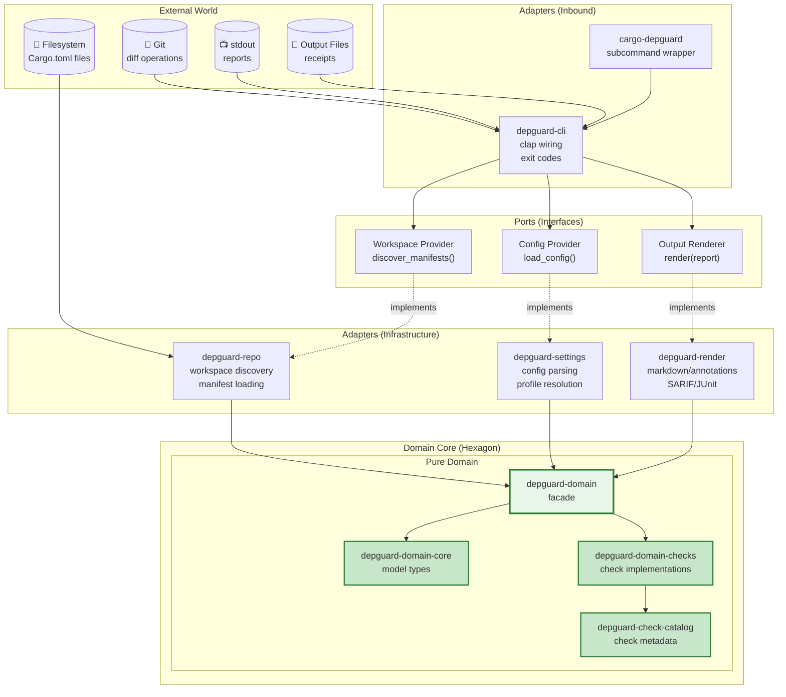
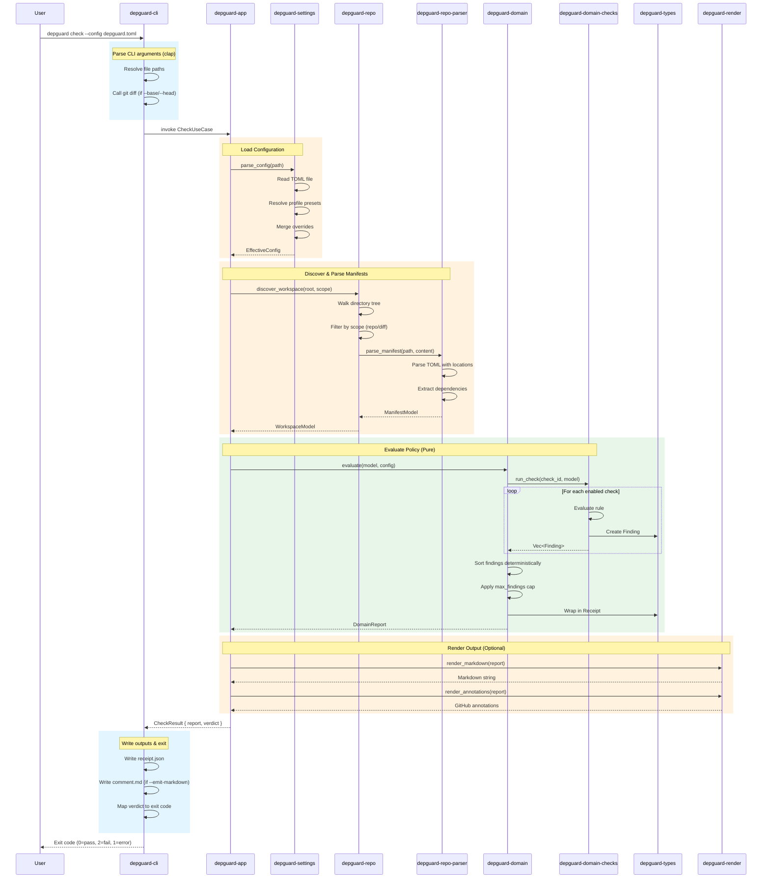

# Architecture

> **Navigation**: [Quick Start](quickstart.md) | [Configuration](config.md) | [Checks](checks.md) | [CI Integration](ci-integration.md) | Architecture | [Design](design.md) | [Testing](testing.md)

Depguard uses **hexagonal (ports & adapters)** architecture with a **pure evaluation core** and a set of **adapters** that translate real repositories into an in-memory model. Think "load-bearing wall" vs "drywall": the domain crate is the wall; everything else can move.

## Architecture Overview Diagram



## Crate overview

| Crate | Purpose |
|-------|---------|
| `depguard-types` | DTOs, config, report, findings; schema IDs; stable codes |
| `depguard-domain` | Facade: re-exports model/policy, delegates checks (pure, no I/O) |
| `depguard-domain-core` | Core model and policy types shared across domain crates |
| `depguard-domain-checks` | Pure check implementations (one module per check) |
| `depguard-check-catalog` | Check metadata, feature gates, and profile defaults |
| `depguard-settings` | Config parsing; profile presets; override resolution |
| `depguard-repo` | Workspace discovery; manifest loading; diff-scope |
| `depguard-repo-parser` | Pure TOML manifest parsing (no filesystem) |
| `depguard-render` | Markdown and GitHub annotations renderers |
| `depguard-app` | Use cases: check, md, annotations, explain; error handling |
| `depguard-cli` | clap wiring; filesystem paths; exit code mapping |
| `depguard-inline-suppressions` | Parse `// depguard:disable` comments in manifests |
| `depguard-yanked` | Offline yanked-index parsing and exact version lookup |
| `depguard-test-util` | Shared test utilities for fixtures and normalization |
| `xtask` | Schema emission; fixture generation; release tasks |

## Crate Dependency Graph

This diagram shows how the 14 crates depend on each other. Arrows point from dependent to dependency (A → B means "A depends on B").



### Dependency Rules

- **`depguard-types`** is the foundation: no depguard dependencies
- **`depguard-domain-core`** depends only on `depguard-types` and `depguard-yanked`
- **`depguard-domain`** is a facade: re-exports from `depguard-domain-core` and delegates to `depguard-domain-checks`
- **`depguard-repo`** depends on `depguard-domain` for the domain model and `depguard-repo-parser` for TOML parsing
- **`depguard-settings`** depends on `depguard-domain-core` for policy types and `depguard-check-catalog` for check metadata
- **`depguard-app`** orchestrates use cases but delegates I/O to callers
- **`depguard-cli`** is the only place allowed to:
  - Call `std::process::Command` (for `git diff`)
  - Read/write files to disk
  - Decide exit codes

## Data flow



The key seam is between `depguard-repo` and `depguard-domain`: once the input model is built, evaluation is deterministic and testable without touching the filesystem.

### Data Flow Steps

1. **CLI Parsing**: `depguard-cli` parses command-line arguments using clap
2. **Config Loading**: `depguard-settings` reads and resolves configuration with profile presets
3. **Workspace Discovery**: `depguard-repo` discovers all `Cargo.toml` files in scope
4. **Manifest Parsing**: `depguard-repo-parser` parses TOML into domain models (pure, no I/O)
5. **Policy Evaluation**: `depguard-domain` evaluates all enabled checks against the model
6. **Report Generation**: Findings are collected, sorted, and wrapped in a receipt envelope
7. **Rendering**: Optional renderers produce Markdown, annotations, SARIF, etc.
8. **Exit**: CLI maps the verdict to an exit code

## Hexagonal Architecture

Depguard follows the **hexagonal (ports & adapters)** pattern, where the domain core is isolated from external concerns through well-defined interfaces.



### Hexagonal Principles in Depguard

| Principle | How Depguard Implements It |
|-----------|---------------------------|
| **Pure Domain** | `depguard-domain*` crates have no filesystem, network, or stdout dependencies |
| **Single Port** | "Provide a `WorkspaceModel` and `EffectiveConfig`" — one main interface |
| **Multiple Adapters** | Real filesystem, in-memory fixtures, synthetic fuzz inputs can all produce models |
| **Dependency Inversion** | Domain defines the model; adapters conform to it |
| **Testability** | Domain can be tested with pure in-memory inputs |

### The "Ports"

Rather than defining dozens of traits, the domain expects an in-memory model:

```rust
// The "port" is implicit: provide these types
struct WorkspaceModel {
    root: RepoPath,
    workspace_dependencies: BTreeMap<String, DepSpec>,
    manifests: Vec<ManifestModel>,
}

struct EffectiveConfig {
    profile: Profile,
    scope: Scope,
    fail_on: FailOn,
    checks: BTreeMap<CheckId, CheckConfig>,
}
```

### The "Adapters"

| Adapter | Responsibility |
|---------|---------------|
| `depguard-repo` | Filesystem + glob expansion + manifest discovery |
| `depguard-repo-parser` | Pure TOML parsing (no I/O) |
| `depguard-settings` | Config file parsing + profile resolution |
| `depguard-cli` | Git diff scoping, exit code mapping |
| `depguard-render` | Output format adapters (Markdown, SARIF, etc.) |

## Component Interaction During Check

This diagram shows the sequence of component interactions during a `depguard check` operation.



### Key Interaction Points

1. **CLI → App**: The CLI layer calls use case functions with resolved paths and config
2. **App → Settings**: Configuration is loaded and resolved before any other work
3. **App → Repo**: Workspace discovery is I/O-bound; the repo adapter handles all filesystem access
4. **Repo → Parser**: TOML parsing is pure; the parser has no I/O dependencies
5. **App → Domain**: Policy evaluation is entirely pure; given the same inputs, it always produces the same outputs
6. **Domain → Checks**: Each check is a pure function that examines the model and produces findings
7. **App → Render**: Rendering is optional and happens after evaluation is complete
8. **CLI Exit**: The CLI is the only layer that decides exit codes

## Core abstractions

Depguard is opinionated about what "policy enforcement" means:

- **Input is manifests, not cargo metadata** (no build graph evaluation).
- **Policy is explicit and versioned** (config + profile).
- **Output is a receipt** (envelope + findings + data summary).
- **CI ergonomics are first-class** (Markdown + annotations + stable ordering).

The core model (owned by `depguard-domain`) is intentionally small:

| Type | Purpose |
|------|---------|
| `WorkspaceModel` | Repo root + workspace dependencies + manifests |
| `ManifestModel` | Path + package metadata + dependency declarations |
| `DependencyDecl` | Kind (normal/dev/build) + name + spec + location |
| `DepSpec` | Version string + path + workspace flag |
| `EffectiveConfig` | Resolved config with profile, scope, fail_on, per-check policies |

## Scopes

Depguard supports two scopes (selected by CLI/config):

| Scope | Behavior |
|-------|----------|
| `repo` | Scan all manifests reachable from the workspace root |
| `diff` | Scan only manifests affected by git refs (`--base`/`--head`) or a precomputed diff file (`--diff-file`), plus root for workspace deps |

Scope selection is an **adapter concern** (repo/git). The domain only sees the final manifest set.

## Findings model

A finding is a structured event:

| Field | Purpose |
|-------|---------|
| `check_id` | Stable identifier for the check (`deps.no_wildcards`, etc.) |
| `code` | Stable sub-code for the specific condition (`wildcard_version`, etc.) |
| `severity` | `info` / `warning` / `error` |
| `location` | Best-effort file + line/col |
| `message` | Human summary |
| `help` / `url` | Remediation guidance |
| `fingerprint` | Stable hash for dedup/trending |
| `data` | Check-specific structured payload (JSON) |

The emitted report is deterministic:
- Canonical path normalization (`RepoPath`)
- Stable ordering: `severity → path → line → check_id → code → message`
- Optional caps (`max_findings`) with explicit truncation reason

## See also

- [Design Notes](design.md) — Design decisions and rationale
- [Microcrates](microcrates.md) — Crate-by-crate contracts
- [Testing](testing.md) — Test strategy and organization
- [Implementation Plan](implementation-plan.md) — Development roadmap
